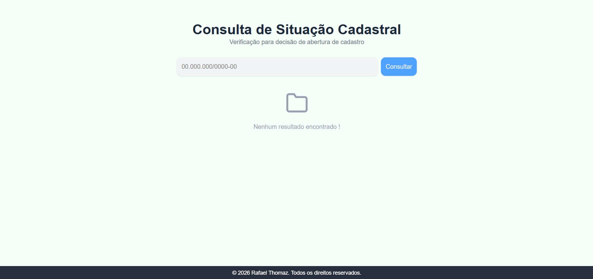
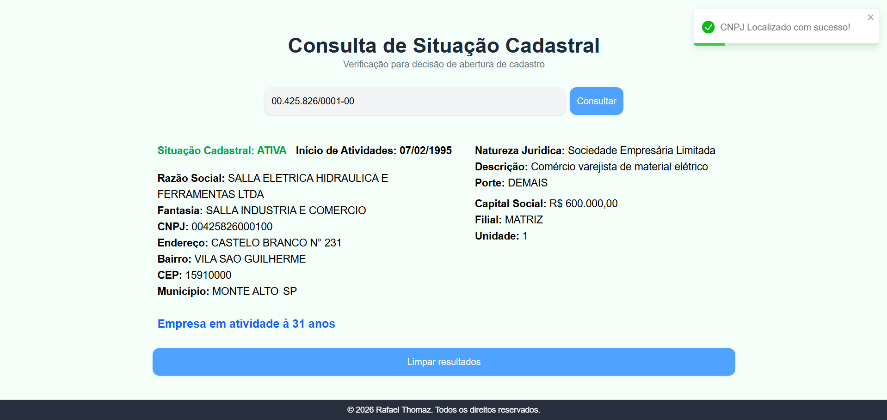

# 🚀 Consulta Cadastral de Empresas

Aplicação web desenvolvida para **agilizar o cadastro de novos clientes**, consumindo dados empresariais via API e auxiliando na **tomada de decisão** sobre a abertura ou não de cadastro.

---

### Tela principal
<!-- Print da tela inicial -->


### Consulta de empresa
<!-- Print após consulta do CNPJ -->


---

## 🧠 Sobre o Projeto

Este projeto foi pensado para facilitar e acelerar meu trabalho no momento de cadastrar um novo cliente.

Ao informar o **CNPJ**, a aplicação realiza uma requisição à API e retorna automaticamente:

- 📌 Dados completos da empresa  
- 🟢 Situação cadastral (ativa ou baixada)  
- 📅 Data de abertura  
- ⏳ Tempo de atuação no mercado  

Essas informações ajudam a **avaliar rapidamente** se vale a pena ou não abrir o cadastro para determinada empresa.

---

## 🛠️ Tecnologias Utilizadas

- React JS
- Tailwind CSS
- Axios
- React Icons
- React Toastify

---
### ⚙️ Funcionalidades

- ✅ Consulta automática de empresas via CNPJ  
- ✅ Exibição de dados completos da empresa  
- ✅ Verificação de situação cadastral (ativa / baixada)  
- ✅ Cálculo do tempo de atuação no mercado  
- ✅ Interface responsiva com Tailwind CSS  
- ✅ Feedback visual com Toastify  

---

## 🔌 API Utilizada

**Brasil API Fácil**
Endpoint base:
```txt
https://api.brasilapifacil.com.br/v1/
```


### ▶️ Como Executar o Projeto

#### Pré-requisitos

- Node.js instalado  
- npm 

---

#### Passo a passo

```bash
# Clone o repositório
git clone https://github.com/seu-usuario/seu-repositorio.git

# Acesse a pasta do projeto
cd seu-repositorio

# Instale as dependências
npm install

# Execute o projeto
npm run dev
